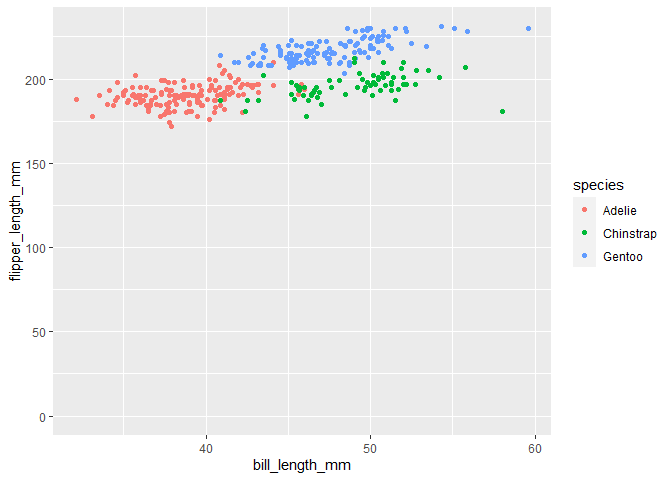

p8105\_hw1\_xc2610
================
Xuanhe Chen
2019-09-21

Problem 1

Create the dataframe accordingly:

``` r
set.seed(5)

random_df = tibble(
  val = rnorm(10, sd = .5), ## random sample of size 10
  vec_logical = c(TRUE, TRUE, TRUE, TRUE, TRUE, TRUE, TRUE, TRUE, TRUE, TRUE), ## initialize the logical factor as all true
  vec_char = c("A", "B", "C", "D", "E", "F", "G", "H", "I", "J"), ## character vector of length 10
  vec_factor = factor(c("pro", "con", "non", "non", "con", "pro", "con", "non", "pro", "non")) ## factor vector of length 10 with 3 different levels
)

## show(random_df)

random_df$vec_logical <- ifelse(random_df$val < 0, FALSE, TRUE) ## edit the logical vector according to positive or not of each sample value

## show(random_df)
```

Then try to get the mean of each variables, mean only works on the
sample value and logical factor:

``` r
mean(pull(random_df, val)) ## try get mean of values
```

    ## [1] -0.03942577

``` r
mean(pull(random_df, vec_logical)) ## try get mean of logical factors
```

    ## [1] 0.4

``` r
mean(pull(random_df, vec_char)) ## try get mean of characters
```

    ## Warning in mean.default(pull(random_df, vec_char)): argument is not numeric or
    ## logical: returning NA

    ## [1] NA

``` r
mean(pull(random_df, vec_factor)) ## try get mean of factors
```

    ## Warning in mean.default(pull(random_df, vec_factor)): argument is not numeric or
    ## logical: returning NA

    ## [1] NA

as.numertic works on vec\_logical and vec\_factor but not vec\_char.
Booleans are considered as 1s and 0s so the mean of a list of booleans
can be calculated. Characters can not be shown as numeric values so we
can’t calculate its mean. We can’t get the mean of factors although it
can be shown as numertic values might because each facotr name doesn’t
map to some particular (like 0 is always False 1 is always true).

``` r
## convert variables to numeric
as.numeric(pull(random_df, vec_logical))
```

    ##  [1] 0 1 0 1 1 0 0 0 0 1

``` r
as.numeric(pull(random_df, vec_char))
```

    ## Warning: NAs introduced by coercion

    ##  [1] NA NA NA NA NA NA NA NA NA NA

``` r
as.numeric(pull(random_df, vec_factor))
```

    ##  [1] 3 1 2 2 1 3 1 2 3 2

Problem 2

This dataset contains 8 variables: “species”, “island”,
“bill\_length\_mm”,
bill\_depth\_mm“,”flipper\_length\_mm“,”body\_mass\_g“,”sex" and “year”.
“species”, “island”, “gender” and “year” are categorical, while
“bill\_length\_mm”, bill\_depth\_mm“,”flipper\_length\_mm" and
“body\_mass\_g” are numerical. The data frame contains 344 rols and 8
columns.

The mean flipper lengths of penguins according to this data is
199.7471mm.

``` r
## get the penguins dataset
data("penguins", package = "palmerpenguins")

## check information about this dataset
names(penguins)
```

    ## [1] "species"           "island"            "bill_length_mm"   
    ## [4] "bill_depth_mm"     "flipper_length_mm" "body_mass_g"      
    ## [7] "sex"               "year"

``` r
## view(penguins)
head(penguins)
```

    ## # A tibble: 6 x 8
    ##   species island bill_length_mm bill_depth_mm flipper_length_~ body_mass_g sex  
    ##   <fct>   <fct>           <dbl>         <dbl>            <int>       <int> <fct>
    ## 1 Adelie  Torge~           39.1          18.7              181        3750 male 
    ## 2 Adelie  Torge~           39.5          17.4              186        3800 fema~
    ## 3 Adelie  Torge~           40.3          18                195        3250 fema~
    ## 4 Adelie  Torge~           NA            NA                 NA          NA <NA> 
    ## 5 Adelie  Torge~           36.7          19.3              193        3450 fema~
    ## 6 Adelie  Torge~           39.3          20.6              190        3650 male 
    ## # ... with 1 more variable: year <int>

``` r
nrow(penguins)
```

    ## [1] 344

``` r
ncol(penguins)
```

    ## [1] 8

``` r
## skimr::skim(penguins)
```

``` r
penguins$flipper_length_mm [is.na(penguins$flipper_length_mm)] <- 0 ## rewite all NA's as 0
## head(penguins)
mean(pull(penguins, flipper_length_mm)) ## calculate the mean length
```

    ## [1] 199.7471

Make a scatterplot of flipperlength vs billlength color points and
assign different color to each species:

``` r
ggplot(penguins, aes(x = bill_length_mm, y = flipper_length_mm, color = species)) + geom_point() ## create a scatter plot according to penguin species
```

    ## Warning: Removed 2 rows containing missing values (geom_point).

<!-- -->

``` r
## save the scatter plot to local
## ggsave("scatter_HW1_P2.pdf", height = 4, width = 6)
```
